# Dingoo A320 Emulator

A portable MIPS32 interpreter-based emulator for Dingoo A320 (JZ4730 SoC) `.app` games.

Runs any standard `.app` binary with Dingoo OS syscall interception, SDL2 display/audio/input, and resource archive support.

---

## Architecture

```
┌──────────────────────────────────────────────────────────────────┐
│                      Host (SDL2 + your OS)                       │
│                                                                  │
│  ┌──────────────────────────────────────────────────────────┐   │
│  │                    Emulator Core                          │   │
│  │  ┌──────────┐  ┌──────────┐  ┌──────────┐  ┌─────────┐ │   │
│  │  │ MIPS32   │  │ MXU      │  │ Memory   │  │ COP0    │ │   │
│  │  │ Decoder  │  │ (COP2)   │  │ Manager  │  │ (stub)  │ │   │
│  │  │ + Exec   │  │          │  │ (flat    │  │         │ │   │
│  │  │          │  │          │  │  KSEG0/1)│  │         │ │   │
│  │  └──────────┘  └──────────┘  └──────────┘  └─────────┘ │   │
│  │                                                          │   │
│  │  ┌──────────────────────────────────────────────────┐   │   │
│  │  │           Dingoo OS Syscall Interception         │   │   │
│  │  │ 97 implemented + 83 stubs = 180 intercepted     │   │   │
│  │  └──────────────────────────────────────────────────┘   │   │
│  │                                                          │   │
│  │  ┌──────────────────────────────────────────────────┐   │   │
│  │  │           Resource Archive Provider              │   │   │
│  │  │  Serves .spk entries from embedded archive data  │   │   │
│  │  └──────────────────────────────────────────────────┘   │   │
│  └──────────────────────────────────────────────────────────┘   │
│                                                                  │
│  ┌──────────┐  ┌──────────┐  ┌──────────┐  ┌────────────────┐   │
│  │ SDL2     │  │ SDL2     │  │ SDL2     │  │ Host FS        │   │
│  │ Video    │  │ Audio    │  │ Events   │  │ (save files)   │   │
│  │ (window) │  │ (PCM out)│  │ (keyboard)│  │                │   │
│  └──────────┘  └──────────┘  └──────────┘  └────────────────┘   │
└──────────────────────────────────────────────────────────────────┘
```

### Core components

| Module | File(s) | Role |
|--------|---------|------|
| MIPS32 interpreter | `cpu.cpp`, `cpu.h` | Fetches, decodes, executes all standard MIPS32 r1 opcodes |
| COP0 | `cop0.cpp`, `cop0.h` | MIPS32 CP0 register handling, TLB-emulation-free mode |
| MXU (COP2) | `mxu.cpp`, `cpu.cpp` | Dingoo DSP coprocessor (30+ ops for audio mixing, fixed-point math) |
| Memory manager | `memory.cpp`, `memory.h` | Flat KSEG0/KSEG1 address map, identity-mapped KUSEG |
| Syscall dispatch | `syscalls.cpp`, `syscalls.h` | Intercepts GOT trampoline calls → host implementations; owns µC/OS-II task scheduler |
| Display | `display.cpp`, `display.h` | SDL2 window, LCD framebuffer, format conversion, key mapping |
| Archive loader | `archive.cpp`, `archive.h` | Parses Dingoo `.spk` archive format |
| App parser | `app_parser.cpp`, `app_parser.h` | Parses `.app` file header (CCDL/IMPT/EXPT/RAWD) |

---

## Building

### Requirements

- **C++17 compiler** (GCC/MinGW-w64 recommended on Windows)
- **SDL2** development libraries
- **MinGW/MSYS2** (on Windows) or equivalent

### Build (Windows/MinGW)

```bash
cd emulator
g++ -pipe -std=c++17 -Wall -Wextra -O2 -g \
  -I/path/to/SDL2/include -Dmain=SDL_main \
  -o emulator.exe src/main.cpp src/app_parser.cpp src/memory.cpp \
  src/cpu.cpp src/cop0.cpp src/syscalls.cpp src/mxu.cpp \
  src/display.cpp src/archive.cpp \
  -L/path/to/SDL2/lib -lmingw32 -lSDL2main -lSDL2
```

Or use the included `Makefile` (check paths for your SDL2 installation):

```bash
cd emulator
make
```

---

## Usage

```bash
./emulator.exe [options] <game.app>

Options:
  --frames <n>        Stop after n CPU frames (0 = unlimited)
  --save-screenshots  Save BMP screenshots periodically
  --nosound           Disable audio output
  --audio-latency <ms>  Max queued audio ahead of playback (default 80, range 20–500)
```

### Examples

```bash
./emulator.exe ../7days.app
./emulator.exe --frames 5000 --save-screenshots ../tetris.app
./emulator.exe --audio-latency 60 ../tetris.app
SDL_VIDEODRIVER=offscreen ./emulator.exe --frames 1000 ../snake.app
```

### Controls

Key bit positions within `KEY_STATUS.status` follow the Dingoo SDK convention
(used by AstroLander `control.h` constants).

| Dingoo button | SDL/Keyboard key | HW bit |
|---------------|------------------|--------|
| A             | Z                | 31     |
| B             | X                | 21     |
| X             | A                | 16     |
| Y             | S                | 6      |
| L             | Q                | 8      |
| R             | W                | 29     |
| START         | Enter            | 11     |
| SELECT        | Tab              | 10     |
| D-Pad Up      | ↑                | 20     |
| D-Pad Down    | ↓                | 27     |
| D-Pad Left    | ←                | 28     |
| D-Pad Right   | →                | 18     |
| Volume +/-    | = / -            | —      |
| Screenshot    | F12              | —      |
| Quit          | Escape           | —      |

F12 writes a PNG of the native 320×240 framebuffer (not the scaled window) to
`screenshots/<game_name><n>.png`, for example `screenshots/tetris1.png`. The
number increments so existing files are not overwritten.

---

## Features & Implementation Status

CPU, display, audio, syscall coverage, app compatibility, and internals are documented in **[docs/FEATURES.md](docs/FEATURES.md)**.

## Supported games

Native 320×240 framebuffer captures (first / mid / last rendered frame) from [`docs/screenshots/`](docs/screenshots/). Compatibility notes are in [docs/FEATURES.md](docs/FEATURES.md#app-compatibility).

### 7days

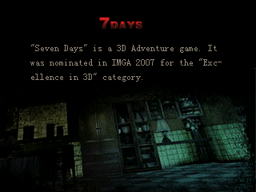
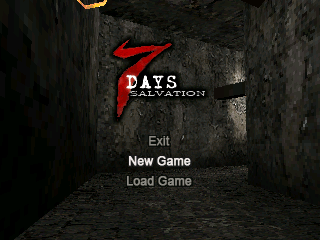
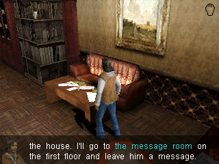

### AliBaba

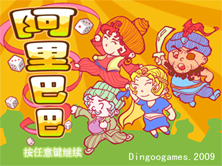
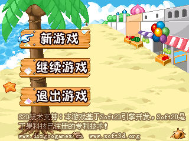
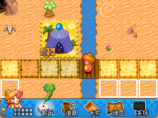

### Block Breaker

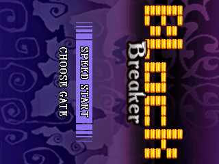
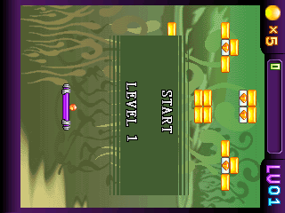
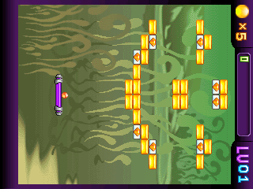

### Candy

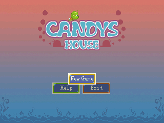
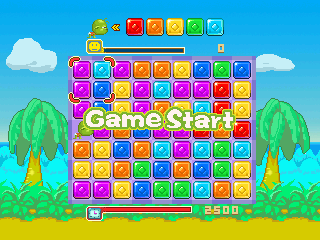
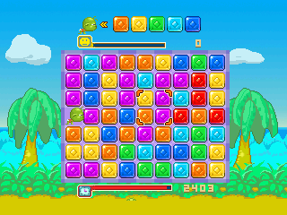

### Decollation Warrior

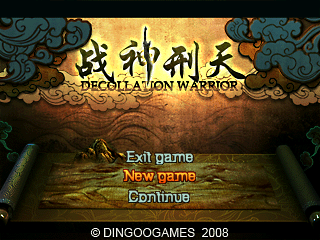
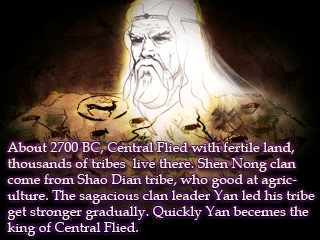
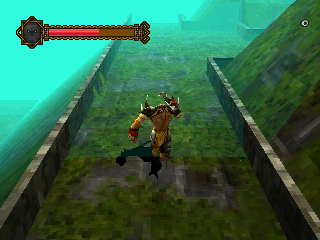

### Formula-One

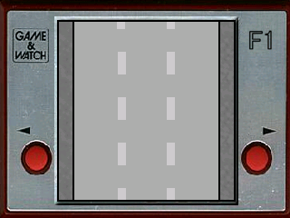
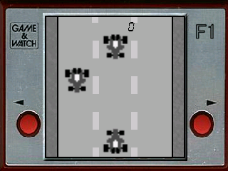
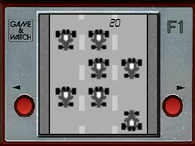

### Hell Striker II

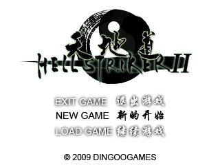
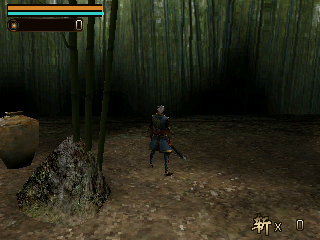
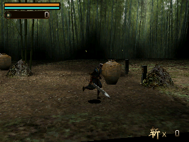

### Landlord

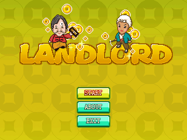
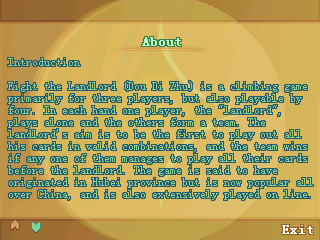
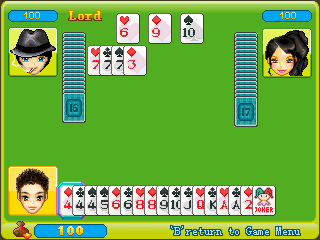

### Link'em Up

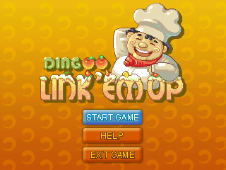
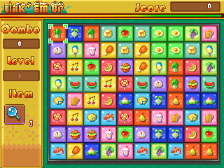
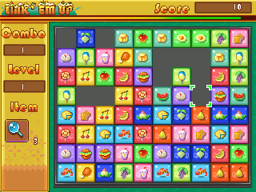

### Manic-Miner

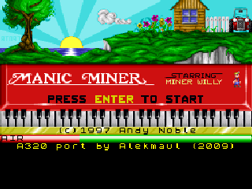
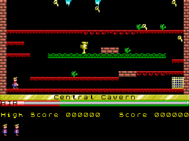
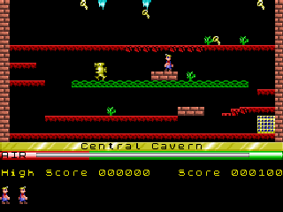

### Mushroom Roulette

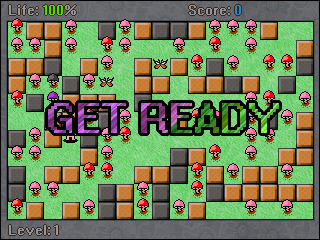
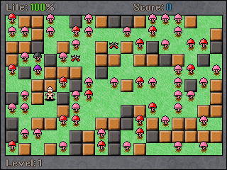
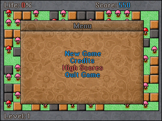

### Nose Breaker

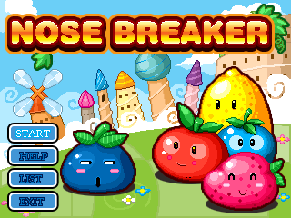
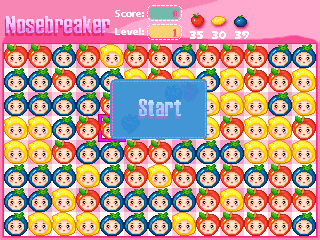
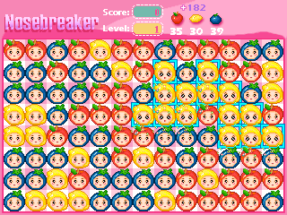

### Platinum Sudoku

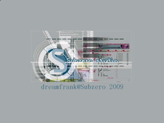
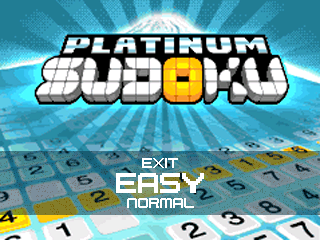
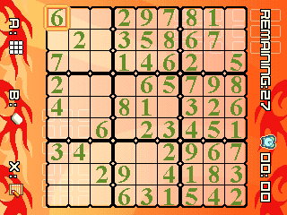

### Puzzle Bobble - PoPo Bash

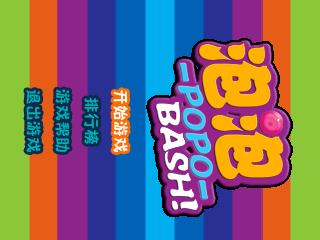
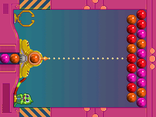
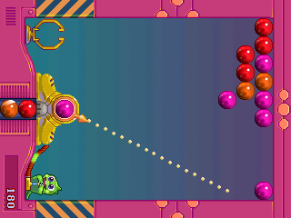

### Rick-Dangerous

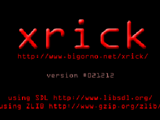
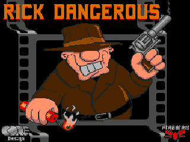
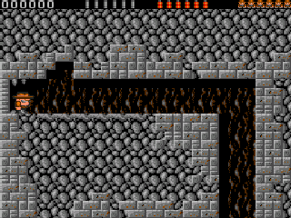

### Rubido

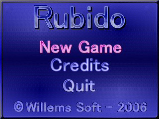
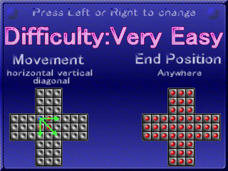
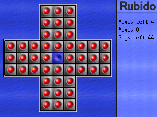

### snake

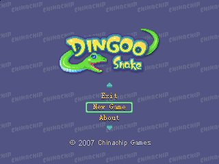
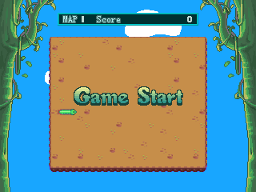


### tetris


### ultimate_drift


### Yi-Chi King Fighter (Overlord Fighter)


### Zhao Yun Chuan (Chinese)


### Zhao Yun Chuan (English)


## Performance

- ~64 million guest MIPS instructions / second on modern x86
- Typically 2M instructions per CPU frame, ~50–60 CPU frames for 1 rendered frame
- Runs approximately 5× slower than real JZ4730 hardware (360 MHz)
- Audio handled via lock-free ring + SDL callback (~20–32 ms fragments)

---
